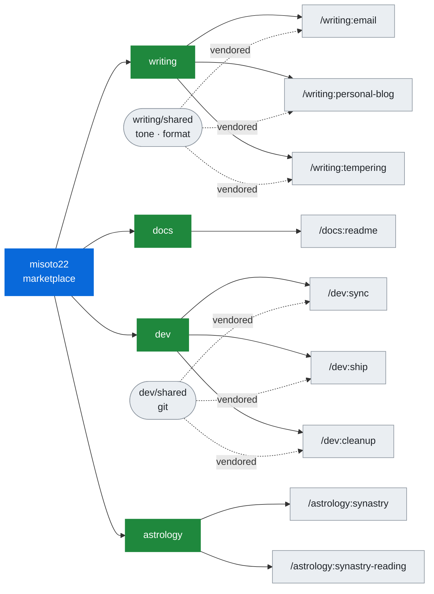

<div align="center">

<picture>
  <source media="(prefers-color-scheme: dark)" srcset="assets/hero-dark.png">
  
</picture>

<br />

<sub><b>English</b> · <a href="README.zh-CN.md">简体中文</a></sub>

<br />

Personal skills for Claude Code, Codex, and ~70 other agents.

<br />

[Latest Release](https://github.com/Misoto22/skills/releases/latest) · [Report Issue](https://github.com/Misoto22/skills/issues)

<br />

[](https://claude.com/claude-code)
[](https://developers.openai.com/codex/cli)
[](https://github.com/vercel-labs/agent-skills)
[](https://skills.sh/Misoto22/skills)
[](https://www.python.org/)

</div>

---

### Skills

Eighteen skills in seven plugins. The plugin name is the command prefix, and each plugin installs on its own — a plugin is a subject, not a bucket.

#### `writing` — prose aimed at a person

- **[email](plugins/writing/skills/email/SKILL.md)** (`/writing:email`) — drafts policy-aware email, or sends exact hashed artefacts and verifies them against the Sent message. Draft is the default, and automated send stays off until a narrow local scope is configured.
- **[personal-blog](plugins/writing/skills/personal-blog/SKILL.md)** (`/writing:personal-blog`) — researches, outlines, drafts, or edits five kinds of personal blog post while preserving supplied evidence and voice; finished articles arrive as raw Markdown.
- **[tempering](plugins/writing/skills/tempering/SKILL.md)** (`/writing:tempering`) — rewrites a blunt or frustrated workplace message into three registers, keeping the request, the date, and the consequence the raw tone was carrying.

#### `docs` — prose aimed at whoever opens the repository next

- **[readme](plugins/docs/skills/readme/SKILL.md)** (`/docs:readme`) — writes, restructures, or audits a repository README from what its own files say, leaving a bracketed placeholder wherever a fact is unavailable.

#### `dev` — the loop around a change

- **[sync](plugins/dev/skills/sync/SKILL.md)** (`/dev:sync`) — fetches, prunes, and fast-forwards the base branch, then reports what diverged. It only fast-forwards; a diverged branch is reported, never rebased.
- **[ship](plugins/dev/skills/ship/SKILL.md)** (`/dev:ship`) — lands the current changes as a merged pull request. A preflight marks each step RUN or SKIP, so a clean tree exits without doing anything, and any step that fails twice stops and asks.
- **[cleanup](plugins/dev/skills/cleanup/SKILL.md)** (`/dev:cleanup`) — removes what shipping left behind: merged branches, their worktrees, and ignored residue a move stranded. Every deletion is verified against the forge, not against git.

#### `brand` — visual identity assets

- **[logo-banner](plugins/brand/skills/logo-banner/SKILL.md)** (`/brand:logo-banner`) — creates confirmed raster logos, icons, favicons, and light/dark social banners through ChatGPT Image; style comes before generation.

#### `photography` — source-faithful comparison boards

- **[photo-abstract-editorial-native](plugins/photography/skills/photo-abstract-editorial-native/SKILL.md)** (`/photography:photo-abstract-editorial-native`) — combines an original photograph with separately supplied lower artwork without stretch or upscale, then records an auditable source manifest.

#### `astrology` — positions computed from birth data

- **[synastry](plugins/astrology/skills/synastry/SKILL.md)** (`/astrology:synastry`) — validates two supplied birth records and writes one uncertainty-aware JSON v2 chart artifact with recorded backend provenance. It is privacy-minimal by default; only an explicitly requested archival mode retains supplied local birth and location provenance. Exact records can include house overlays, then it starts the separate reading automatically.
- **[synastry-reading](plugins/astrology/skills/synastry-reading/SKILL.md)** (`/astrology:synastry-reading`) — privately validates a JSON v2 chart artifact before writing an adaptive, evidence-linked Markdown report with only explicitly requested relationship domains.

#### `chinese-metaphysics` — four pillars computed from the Chinese calendar

- **[bazi-chart](plugins/chinese-metaphysics/skills/bazi-chart/SKILL.md)** (`/chinese-metaphysics:bazi-chart`) — computes one reusable BaZi chart as canonical JSON and data-only Markdown.
- **[bazi-reading](plugins/chinese-metaphysics/skills/bazi-reading/SKILL.md)** (`/chinese-metaphysics:bazi-reading`) — interprets a verified single-person chart as a reader-first natal report with a separate audit artifact.
- **[bazi-compatibility](plugins/chinese-metaphysics/skills/bazi-compatibility/SKILL.md)** (`/chinese-metaphysics:bazi-compatibility`) — compares two charts with auditable directional evidence and transparent scores.
- **[bazi-compatibility-reading](plugins/chinese-metaphysics/skills/bazi-compatibility-reading/SKILL.md)** (`/chinese-metaphysics:bazi-compatibility-reading`) — explains a completed comparison as a reader report with separate evidence, without altering its source data or model results.

---

### Install

```bash
claude plugin marketplace add Misoto22/skills
claude plugin install all@misoto22
```

`all` carries no skills. It depends on the seven plugins above and the six [bookmarks](#bookmarks) below, so one command installs everything. To take a subject on its own, name it instead — `claude plugin install writing@misoto22`.

> [!NOTE]
> All four routes below are exercised by CI on every push, against the tree the
> installer actually produces rather than against this repository. What CI does
> not install is the bookmarks: they are other people's repositories, and a
> forced push in one of them is not this repository's build to fail. The list
> `all` depends on is checked against the marketplace on every run.

<details>
<summary><b>Codex</b> — reads the same marketplace manifest</summary>

```bash
codex plugin marketplace add https://github.com/Misoto22/skills
codex plugin add all@misoto22
```

</details>

<details>
<summary><b>ChatGPT, Cursor, GitHub Copilot, Kiro, VS Code</b> — the Agent Plugins format</summary>

Every plugin here ships a second manifest, `plugins/<name>/plugin.json`, in the [Agent Plugins](https://agent-plugins.org/) format Amazon, Cursor, Microsoft, OpenAI and Vercel published in August 2026. Point a client that implements it at the plugin directory; the `skills/` tree beside it is the same one Claude Code reads.

Two manifests rather than one because neither reader sees the other's: Claude Code requires a `skills` array that the Agent Plugins schema rejects, and that schema is closed. The validator asserts the fields they share agree, and one bump moves both.

`all` has no equivalent here. It is nothing but a dependency list, and the format defines no dependencies — the one-command install stays a Claude Code and Codex route.

</details>

<details>
<summary><b>Cursor, Windsurf, opencode, and ~70 more</b> — one command, then pick</summary>

```bash
npx skills add Misoto22/skills
```

Asks which skills, which agents, project or global, and symlink or copy. Symlinked installs track this repository; copies do not, so rerun the command to update one.

To skip the questions — in CI, or when you already know — pin the version and answer them as flags:

```bash
npx --yes skills@1.5.22 add Misoto22/skills --agent '*' --skill '*'
```

Narrow it with `--skill email --agent cursor`.

</details>

<details>
<summary><b>claude.ai and Cowork</b> — upload a <code>.skill</code> file</summary>

Marketplace sync is an organization feature, so on a personal plan these two take a file. Download the `.skill` archives from the [latest release](https://github.com/Misoto22/skills/releases/latest) and upload them in the skills UI.

Every release also carries `SHA256SUMS` and a signed build attestation, since this route is a download rather than a sync:

```bash
sha256sum -c SHA256SUMS
gh attestation verify email.skill --repo Misoto22/skills
```

</details>

<details>
<summary><b>From a local clone</b>, or as editable links</summary>

Substitute the clone's path for `Misoto22/skills` in any command above.

Maintainers who want editable installs rather than copies can run `bash scripts/link-skills.sh` — it links published skill directories only, never overwrites a real file or directory, and stops on conflicts.

</details>

---

### Directories

This repository is listed on [skills.sh](https://skills.sh/Misoto22/skills), which reads [`skills.sh.json`](skills.sh.json) and offers the same skills grouped by plugin.

The rest index Agent Skills repositories at large. None of them carry this one — they are here for the skills it does not cover:

- [Skills Directory](https://www.skillsdirectory.com/) — scans every listed skill for prompt injection, credential theft, and data exfiltration before publishing it.
- [Claude Skills Hub](https://claudeskills.info/) — community submissions, reviewed by hand.
- [OpenAgentSkill](https://www.openagentskill.com/) — attaches risk signals and a fit score to each skill.
- [SkillsMP](https://skillsmp.com/) — aggregates GitHub, and answers a public search API at `/api/v1/skills/search`.

---

### Bookmarks

Six more plugins install from this marketplace, and none of them is mine. Nothing is vendored: each entry points at its owner's repository, pinned to one commit, and installs from there. `all@misoto22` above pulls in every one of them; these are the names to use when you want a single one.

```bash
claude plugin install obsidian@misoto22
```

The headings are the `category` each entry declares, so `/plugin` groups them the same way while browsing. The vocabulary is Anthropic's, which sorts these alongside every other marketplace rather than into a category of one.

#### `development`

- **[codex](https://github.com/openai/codex-plugin-cc)** (`codex@misoto22`) — hands a stuck task or a second review pass to Codex without leaving Claude Code.
- **[everything-claude-code](https://github.com/affaan-m/everything-claude-code)** (`everything-claude-code@misoto22`) — one very large plugin: agents, skills, and legacy command shims collected in bulk.
- **[mattpocock-skills](https://github.com/mattpocock/skills)** (`mattpocock-skills@misoto22`) — Matt Pocock's engineering skills. `grill-me` is the one worth arriving for: it interviews you about a plan until every branch of the design tree is resolved. The other twenty-four arrive with it — the plugin is the unit its owner publishes, and nothing here is vendored.

#### `productivity`

- **[i-have-adhd](https://github.com/ayghri/i-have-adhd)** (`i-have-adhd@misoto22`) — shapes every reply to lead with the next action instead of the preamble.
- **[obsidian](https://github.com/kepano/obsidian-skills)** (`obsidian@misoto22`) — an Obsidian vault from the command line, including Bases, Canvas, and plugin debugging.

#### `monitoring`

- **[warp](https://github.com/warpdotdev/claude-code-warp)** (`warp@misoto22`) — native Warp notifications when a run finishes or stops to ask.
- **[ziwei-chart](plugins/chinese-metaphysics/skills/ziwei-chart/SKILL.md)** (`/chinese-metaphysics:ziwei-chart`) — places one twelve-palace Zi Wei chart as canonical JSON and data-only Markdown, and refuses to run without a stated gender.
- **[ziwei-reading](plugins/chinese-metaphysics/skills/ziwei-reading/SKILL.md)** (`/chinese-metaphysics:ziwei-reading`) — interprets a placed Zi Wei chart as a reader-first report with a separate audit artifact, and an ink-wash poster only when asked.
- **[bazi-ziwei-cross](plugins/chinese-metaphysics/skills/bazi-ziwei-cross/SKILL.md)** (`/chinese-metaphysics:bazi-ziwei-cross`) — reads one person's BaZi and Zi Wei charts against each other, recording contradictions instead of averaging them into a score.
Claude Code and Codex both install these. `npx skills add` and the skills.sh listing do not show them at all: they clone this repository and read the skills on disk, so a plugin that lives in someone else's repository is not theirs to offer. Those two routes stay at the fifteen skills above.

> [!NOTE]
> The pinned commit is the point. A bookmark tracking a branch would install
> whatever its repository holds at install time, so upstream — or anyone who
> takes it over — could change what these commands install without touching
> this repository. Moving a bookmark forward is an edit to `sha` here, reviewed
> like any other. Nothing in `plugins/` is affected, and neither is CI: the
> install workflow derives its list from the tree on disk.

---

### Self-contained after install

> [!IMPORTANT]
> Every installer copies a plugin — or, on most agents, a single skill directory —
> and nothing above it. A reference that climbs out with `../` resolves in this
> repository and dangles everywhere else, and only Claude Code expands
> `${CLAUDE_*}`. Both forms are rejected in published skill content.

Rules shared by three skills live in `plugins/<plugin>/shared/`, the only copy anyone edits. `scripts/sync-shared.py` vendors it into each skill and commits the copies, so a plain clone installs correctly; the validator, the packager, and CI all fail on drift. `scripts/verify-install.py <dir>` asserts the guarantee against a real installed tree — point it at a plugin cache, an `~/.agents/skills` copy, or an unpacked `.skill`.



<details>
<summary>The directories behind that</summary>

```
.claude-plugin/marketplace.json   Marketplace: misoto22
plugins/<plugin>/
├── .claude-plugin/plugin.json    Plugin manifest → /<plugin>:*
├── shared/                       Rules its skills read, the only copy anyone edits
└── skills/<skill>/               SKILL.md, references/, agents/, a vendored shared/
scripts/                          Validation, packaging, vendoring, install verification
tests/  evals/  docs/             Contract tests, per-skill trigger cases, guides
```

</details>

This repository holds no transport credential and implements no SMTP. The email skill validates and hashes artefacts; sending them is the caller's transport.

---

### Contributing

```bash
git clone https://github.com/Misoto22/skills.git
cd skills
python3 scripts/validate-repository.py    # metadata, registries, skills, then 214 tests
```

Python 3.11+ and Bash are the whole toolchain — no package manager, no lockfile, no build step. `python3 scripts/new-skill.py <plugin> <skill>` scaffolds a skill and registers it everywhere the validator looks.

[CONTRIBUTING.md](CONTRIBUTING.md) has the rest: the checks CI runs, what belongs in a `description`, and how a release is cut. Conventions are in [AGENTS.md](AGENTS.md), releases in [CHANGELOG.md](CHANGELOG.md), and configuring the email skill in [docs/email.md](docs/email.md).

---

<div align="center">
<sub>Built by Henry Chen · <a href="LICENSE">MIT</a></sub>
</div>
