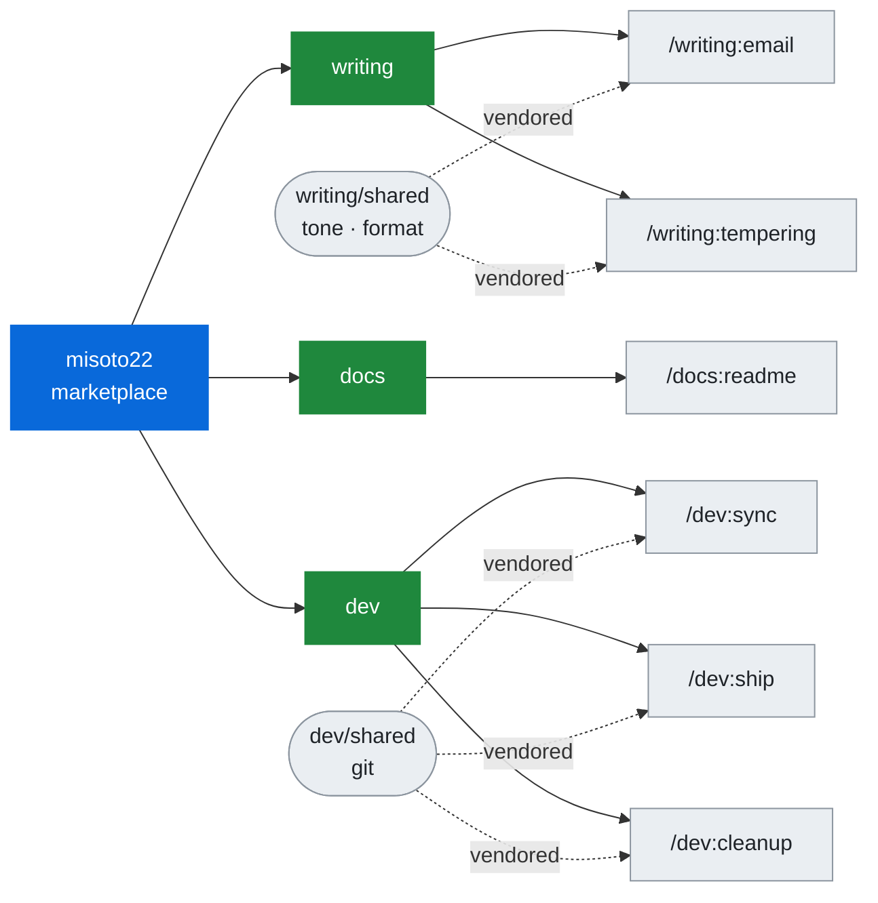

# skills

<div align="center">

<picture>
  <source media="(prefers-color-scheme: dark)" srcset="assets/hero-dark.svg">
  
</picture>

<br />

Personal skills for Claude Code, Codex, and ~70 other agents.

<br />

[Latest Release](https://github.com/Misoto22/skills/releases/latest) · [Report Issue](https://github.com/Misoto22/skills/issues)

<br />

[](https://claude.com/claude-code)
[](https://developers.openai.com/codex/cli)
[](https://github.com/vercel-labs/agent-skills)
[](https://www.python.org/)

</div>

---

### Skills

Six skills in three plugins. The plugin name is the command prefix, and each plugin installs on its own — a plugin is a subject, not a bucket.

#### `writing` — prose aimed at a person

- **[email](plugins/writing/skills/email/SKILL.md)** (`/writing:email`) — drafts policy-aware email, or sends exact hashed artefacts and verifies them against the Sent message. Draft is the default, and automated send stays off until a narrow local scope is configured.
- **[tempering](plugins/writing/skills/tempering/SKILL.md)** (`/writing:tempering`) — rewrites a blunt or frustrated workplace message into three registers, keeping the request, the date, and the consequence the raw tone was carrying.

#### `docs` — prose aimed at whoever opens the repository next

- **[readme](plugins/docs/skills/readme/SKILL.md)** (`/docs:readme`) — writes, restructures, or audits a repository README from what its own files say, leaving a bracketed placeholder wherever a fact is unavailable.

#### `dev` — the loop around a change

- **[sync](plugins/dev/skills/sync/SKILL.md)** (`/dev:sync`) — fetches, prunes, and fast-forwards the base branch, then reports what diverged. It only fast-forwards; a diverged branch is reported, never rebased.
- **[ship](plugins/dev/skills/ship/SKILL.md)** (`/dev:ship`) — lands the current changes as a merged pull request. A preflight marks each step RUN or SKIP, so a clean tree exits without doing anything, and any step that fails twice stops and asks.
- **[cleanup](plugins/dev/skills/cleanup/SKILL.md)** (`/dev:cleanup`) — removes what shipping left behind: merged branches, their worktrees, and ignored residue a move stranded. Every deletion is verified against the forge, not against git.

---

### Install

```bash
claude plugin marketplace add Misoto22/skills
claude plugin install writing@misoto22
claude plugin install docs@misoto22
claude plugin install dev@misoto22
```

> [!NOTE]
> All four routes below are exercised by CI on every push, against the tree the
> installer actually produces rather than against this repository.

<details>
<summary><b>Codex</b> — reads the same marketplace manifest</summary>

```bash
codex plugin marketplace add https://github.com/Misoto22/skills
codex plugin add writing@misoto22
codex plugin add docs@misoto22
codex plugin add dev@misoto22
```

</details>

<details>
<summary><b>Cursor, Windsurf, opencode, and ~70 more</b> — one command, then pick</summary>

```bash
npx skills add Misoto22/skills
```

Asks which skills, which agents, project or global, and symlink or copy. Symlinked installs track this repository; copies do not, so rerun the command to update one.

To skip the questions — in CI, or when you already know — pin the version and answer them as flags:

```bash
npx --yes skills@1.5.22 add Misoto22/skills --agent '*' --skill '*'
```

Narrow it with `--skill email --agent cursor`.

</details>

<details>
<summary><b>claude.ai and Cowork</b> — upload a <code>.skill</code> file</summary>

Marketplace sync is an organization feature, so on a personal plan these two take a file. Download the `.skill` archives from the [latest release](https://github.com/Misoto22/skills/releases/latest) and upload them in the skills UI.

Every release also carries `SHA256SUMS` and a signed build attestation, since this route is a download rather than a sync:

```bash
sha256sum -c SHA256SUMS
gh attestation verify email.skill --repo Misoto22/skills
```

</details>

<details>
<summary><b>From a local clone</b>, or as editable links</summary>

Substitute the clone's path for `Misoto22/skills` in any command above.

Maintainers who want editable installs rather than copies can run `bash scripts/link-skills.sh` — it links published skill directories only, never overwrites a real file or directory, and stops on conflicts.

</details>

---

### Self-contained after install

> [!IMPORTANT]
> Every installer copies a plugin — or, on most agents, a single skill directory —
> and nothing above it. A reference that climbs out with `../` resolves in this
> repository and dangles everywhere else, and only Claude Code expands
> `${CLAUDE_*}`. Both forms are rejected in published skill content.

Rules two skills share live in `plugins/<plugin>/shared/`, the only copy anyone edits. `scripts/sync-shared.py` vendors it into each skill and commits the copies, so a plain clone installs correctly; the validator, the packager, and CI all fail on drift. `scripts/verify-install.py <dir>` asserts the guarantee against a real installed tree — point it at a plugin cache, an `~/.agents/skills` copy, or an unpacked `.skill`.



<details>
<summary>The directories behind that</summary>

```
.claude-plugin/marketplace.json   Marketplace: misoto22
plugins/<plugin>/
├── .claude-plugin/plugin.json    Plugin manifest → /<plugin>:*
├── shared/                       Rules its skills read, the only copy anyone edits
└── skills/<skill>/               SKILL.md, references/, agents/, a vendored shared/
scripts/                          Validation, packaging, vendoring, install verification
tests/  evals/  docs/             Contract tests, email send-gate cases, guides
```

</details>

This repository holds no transport credential and implements no SMTP. The email skill validates and hashes artefacts; sending them is the caller's transport.

---

### Contributing

```bash
git clone https://github.com/Misoto22/skills.git
cd skills
python3 scripts/validate-repository.py    # metadata, registries, skills, then 119 tests
```

Python 3.11+ and Bash are the whole toolchain — no package manager, no lockfile, no build step. `python3 scripts/new-skill.py <plugin> <skill>` scaffolds a skill and registers it everywhere the validator looks.

[CONTRIBUTING.md](CONTRIBUTING.md) has the rest: the checks CI runs, what belongs in a `description`, and how a release is cut. Conventions are in [AGENTS.md](AGENTS.md), releases in [CHANGELOG.md](CHANGELOG.md), and configuring the email skill in [docs/email.md](docs/email.md).

---

<div align="center">
<sub>Built by Henry Chen · <a href="LICENSE">MIT</a></sub>
</div>
