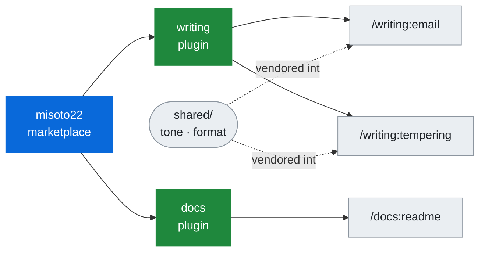

# skills

<div align="center">

<picture>
  <source media="(prefers-color-scheme: dark)" srcset="assets/hero-dark.svg">
  
</picture>

<br />

Personal skills for Claude Code, Codex, and ~50 other agents.

<br />

[Latest Release](https://github.com/Misoto22/skills/releases/latest) · [Report Issue](https://github.com/Misoto22/skills/issues)

<br />

[](https://claude.com/claude-code)
[](https://developers.openai.com/codex/cli)
[](https://github.com/vercel-labs/agent-skills)
[](https://www.python.org/)

</div>

---

### Skills

Three skills across two plugins. The plugin name is the command prefix, so one repository can grow subjects that install separately.

- **[email](plugins/writing/skills/email/SKILL.md)** (`/writing:email`) — drafts policy-aware email, or sends exact hashed artefacts and verifies them against the Sent message. Draft is the default, and automated send stays off until a narrow local scope is configured.
- **[tempering](plugins/writing/skills/tempering/SKILL.md)** (`/writing:tempering`) — rewrites a blunt or frustrated workplace message into three registers, keeping the request, the date, and the consequence the raw tone was carrying.
- **[readme](plugins/docs/skills/readme/SKILL.md)** (`/docs:readme`) — writes, restructures, or audits a repository README from what its own files say, leaving a bracketed placeholder wherever a fact is unavailable.

A plugin is a subject, not a bucket. `writing` is prose aimed at a person; `docs` is prose aimed at whoever opens the repository next.

---

### Tech Stack

| | |
|:--|:--|
| **Runtime** | Dependency-free Python 3.11+ · Bash |
| **Skills** | Markdown `SKILL.md` · Agent Skills frontmatter · `agents/openai.yaml` interfaces |
| **Testing** | `unittest` — 110 tests, no third-party runner |
| **CI** | Validate (metadata · tests on 3.11 and 3.13) · Install (four routes) · Release (`.skill` on tag) |

No package manager, no lockfile, no build step. `python3` and `bash` are the whole toolchain.

---

### Install

```bash
claude plugin marketplace add Misoto22/skills
claude plugin install writing@misoto22
claude plugin install docs@misoto22
```

Each plugin installs independently — take only the subjects you want.

> [!NOTE]
> All four routes below are exercised by CI on every push, against the tree the
> installer actually produces rather than against this repository.

<details>
<summary><b>Codex</b> — reads the same marketplace manifest</summary>

```bash
codex plugin marketplace add https://github.com/Misoto22/skills
codex plugin add writing@misoto22
codex plugin add docs@misoto22
```

</details>

<details>
<summary><b>Cursor, Windsurf, opencode, and ~50 more</b> — one command for all of them</summary>

Installs into every agent directory present on the machine: Cursor · Windsurf · opencode · Roo · Kilo Code · Qwen · iFlow · Trae · Junie · Continue · Goose · Crush, and about forty others.

```bash
npx --yes skills@1.5.20 add Misoto22/skills --agent '*' --skill '*'
```

Name one instead with `--agent cursor`, or drop the flag to be prompted. This is a copy, not a link: rerun the command to update.

</details>

<details>
<summary><b>claude.ai and Cowork</b> — upload a <code>.skill</code> file</summary>

Marketplace sync is an organization feature, so on a personal plan these two take a file. Download the `.skill` archives from the [latest release](https://github.com/Misoto22/skills/releases/latest) and upload them in the skills UI.

</details>

<details>
<summary><b>From a local clone</b>, or as editable links</summary>

Substitute the clone's path for `Misoto22/skills` in any command above.

Maintainers who want editable installs rather than copies can run `bash scripts/link-skills.sh` — it links published skill directories only, never overwrites a real file or directory, and stops on conflicts.

</details>

---

### Project Structure



<details>
<summary>The directories behind that</summary>

```
.claude-plugin/marketplace.json   Marketplace: misoto22
plugins/
├── writing/                      Plugin: writing → /writing:*
│   ├── shared/                   Tone and format rules, the only copy anyone edits
│   └── skills/                   email, tempering
└── docs/                         Plugin: docs → /docs:*
    └── skills/                   readme
scripts/                          Validation, packaging, vendoring, install verification
tests/                            Repository contract + email skill unit tests
evals/                            Adversarial cases for the email skill's send gates
docs/                             Email configuration guide, design records
```

</details>

---

### Self-contained after install

> [!IMPORTANT]
> Every installer copies a plugin — or, on most agents, a single skill directory —
> and nothing above it. A reference that climbs out with `../` resolves in this
> repository and dangles everywhere else, and only Claude Code expands
> `${CLAUDE_*}`. Both forms are rejected in published skill content.

`plugins/writing/shared/` is the only copy anyone edits. `scripts/sync-shared.py` vendors it into each `skills/<skill>/shared/`, those copies are committed so a plain clone installs correctly, and the validator, the packager, and CI all fail on drift.

`scripts/verify-install.py <dir>` asserts the guarantee against a real installed tree rather than against this repository. Point it at a plugin cache, an `~/.agents/skills` copy, or an unpacked `.skill` to reproduce what CI checks.

This repository holds no transport credential and implements no SMTP. The email skill validates and hashes artefacts; sending them is the caller's transport.

---

### Development

```bash
git clone https://github.com/Misoto22/skills.git
cd skills
python3 scripts/validate-repository.py    # metadata, registries, skills, then the tests
```

**Prerequisites** — Python 3.11+ and Bash. Nothing to install.

```
python3 -m unittest discover -s tests -v             All 110 tests
python3 scripts/validate-repository.py --skip-tests  Metadata and registries only
python3 scripts/sync-shared.py                       Vendor shared/ into each skill
bash scripts/list-skills.sh                          Published SKILL.md paths
python3 scripts/package-skill.py <skill> dist        Build one .skill archive
python3 scripts/verify-install.py <dir>              Check an installed tree
python3 scripts/new-skill.py <plugin> <skill>        Scaffold and register a skill
python3 scripts/bump-version.py --audit              Find undeclared version strings
```

Adding a plugin or skill means adding it to `PUBLISHED` in `scripts/validate-repository.py`, to `marketplace.json`, to both READMEs, and to the install workflow's `--expect` list. `python3 scripts/new-skill.py <plugin> <skill>` does all of that and leaves the placeholders to you. Conventions are in [AGENTS.md](AGENTS.md); the contributor workflow is in [CONTRIBUTING.md](CONTRIBUTING.md).

---

### Release

Pushing a `v*` tag packages every published skill and attaches the `.skill` files to a GitHub Release, which is how claude.ai and Cowork are served on a personal plan.

```bash
git tag -a v0.4.0 -m "skills v0.4.0" && git push origin v0.4.0
```

Bump the version in both `plugin.json` files, all three `SKILL.md` frontmatters, `VERSION` in the validator, and the version assertions first — the validator holds them to one number.

---

### Documentation

[docs/email.md](docs/email.md) covers configuring the email skill: copy [`policy.example.json`](plugins/writing/skills/email/policy.example.json) to `.agents/email-policy.json` and replace the reserved example identity.

> [!TIP]
> Draft is always the default. Automated send stays off until a narrow local scope
> is configured explicitly, and a send is only reported successful after the Sent
> message has been read back and compared. [CHANGELOG.md](CHANGELOG.md) records every release, and design records live in [`docs/superpowers/`](docs/superpowers/).

---

<div align="center">
<sub>Built by Henry Chen · <a href="LICENSE">MIT</a></sub>
</div>
