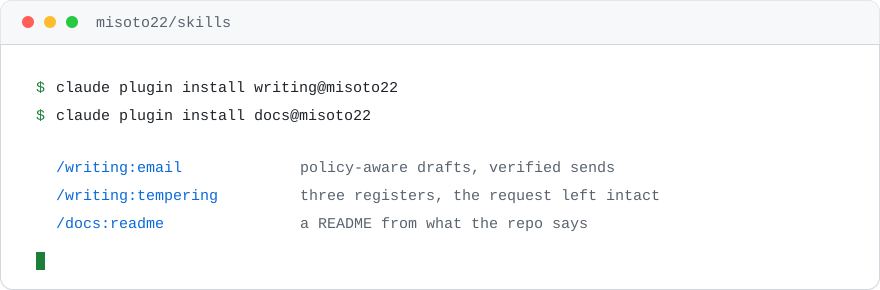
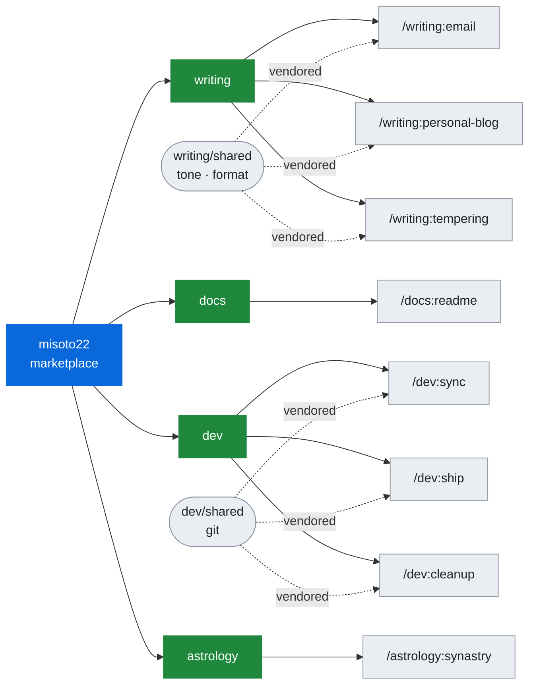

<div align="right"><a href="README.md">English</a> · <b>简体中文</b></div>

<div align="center">

<h1>skills</h1>

<picture>
  <source media="(prefers-color-scheme: dark)" srcset="assets/hero-dark.svg">
  
</picture>

<br />

给 Claude Code、Codex 和另外约 70 个 agent 用的个人 skills。

<br />

[最新发布](https://github.com/Misoto22/skills/releases/latest) · [反馈问题](https://github.com/Misoto22/skills/issues)

<br />

[](https://claude.com/claude-code)
[](https://developers.openai.com/codex/cli)
[](https://github.com/vercel-labs/agent-skills)
[](https://skills.sh/Misoto22/skills)
[](https://www.python.org/)

</div>

---

### Skills

四个 plugin，八个 skill。plugin 名就是命令前缀，每个 plugin 都能单独安装 —— plugin 划分的是主题，不是杂物筐。

#### `writing` —— 写给人看的文字

- **[email](plugins/writing/skills/email/SKILL.md)**（`/writing:email`）—— 按预设的策略起草邮件；也能发送，发完再拿哈希逐字比对已发送的那封，确认内容没被中途改动。默认只起草，自动发送要先配好一个足够窄的授权范围才会打开。
- **[personal-blog](plugins/writing/skills/personal-blog/SKILL.md)**（`/writing:personal-blog`）—— 研究、列提纲、起草或编辑五类个人博客文章，保留作者提供的证据和文风；成稿直接以原始 Markdown 返回。
- **[tempering](plugins/writing/skills/tempering/SKILL.md)**（`/writing:tempering`）—— 把生硬或带火气的职场消息改写成三种轻重不同的说法，原话里的诉求、日期和后果一个都不丢。

#### `docs` —— 写给下一个打开这个仓库的人

- **[readme](plugins/docs/skills/readme/SKILL.md)**（`/docs:readme`）—— 依据仓库自己的文件写、重构或审查 README，凡是文件里查不到的，留一个方括号占位符，不猜。

#### `dev` —— 一次改动的完整闭环

- **[sync](plugins/dev/skills/sync/SKILL.md)**（`/dev:sync`）—— 拉取远端、清掉已删除的远端分支引用、把基准分支快进到最新，然后报告哪里对不上。它只做快进：分叉了就如实报告，绝不替你 rebase。
- **[ship](plugins/dev/skills/ship/SKILL.md)**（`/dev:ship`）—— 把当前改动开成 PR，等 CI 绿了合掉。开跑前先预检，每一步标成 RUN 或 SKIP，所以工作区本来就干净时它什么都不做就退出；哪一步连失败两次就停下来问。
- **[cleanup](plugins/dev/skills/cleanup/SKILL.md)**（`/dev:cleanup`）—— 清掉 ship 之后留下的东西：已合并的分支、它们的 worktree，以及移动目录时被 gitignore 挡住、留在原地的残余。每一次删除都拿 GitHub 上的状态核对过，而不是听 git 的。

#### `astrology` —— 按出生时间和地点排盘

- **[synastry](plugins/astrology/skills/synastry/SKILL.md)**（`/astrology:synastry`）—— 排出两个人的本命盘，算出彼此之间的全部相位，以及各自落进对方的哪些宫位。出生时间不精确到分钟就拒绝计算。它只出数据，怎么解读是另一回事。

---

### 安装

```bash
claude plugin marketplace add Misoto22/skills
claude plugin install all@misoto22
```

`all` 自己不带任何 skill。它依赖上面四个 plugin 和下面五个[书签](#书签)，所以一条命令装齐九个。只想要其中一类就单独装 —— `claude plugin install writing@misoto22`。

> [!NOTE]
> 下面四条安装路径每次 push 都跑 CI，验的是安装器真正产出的目录树，而不是这个仓库本身。
> CI 不装的是书签：那是别人的仓库，其中一个强推不该让这个仓库的构建变红。
> `all` 依赖的那份清单每次都会和 marketplace 对账。

<details>
<summary><b>Codex</b> —— 读同一份 marketplace 清单</summary>

```bash
codex plugin marketplace add https://github.com/Misoto22/skills
codex plugin add all@misoto22
```

</details>

<details>
<summary><b>ChatGPT、Cursor、GitHub Copilot、Kiro、VS Code</b> —— Agent Plugins 格式</summary>

这里每个 plugin 都额外带一份清单 `plugins/<name>/plugin.json`，用的是 Amazon、Cursor、Microsoft、OpenAI 和 Vercel 在 2026 年 8 月发布的 [Agent Plugins](https://agent-plugins.org/) 格式。让实现了这个格式的客户端指向 plugin 目录即可；旁边的 `skills/` 目录树和 Claude Code 读的是同一份。

之所以是两份清单而不是一份：两边互相看不见对方的字段。Claude Code 需要一个 `skills` 数组，而 Agent Plugins 的 schema 是封闭的，会拒绝这个字段。校验器会断言两份共有的字段一致，一次 bump 同时改动两份。

`all` 在这里没有对应物。它除了一份依赖清单什么都不是，而这个格式不定义依赖 —— 一条命令装齐仍然只是 Claude Code 和 Codex 的路径。

</details>

<details>
<summary><b>Cursor、Windsurf、opencode 等约 70 个</b> —— 一条命令，然后自己挑</summary>

```bash
npx skills add Misoto22/skills
```

会依次问：装哪些 skill、给哪些 agent、装到项目还是全局、用软链还是拷贝。软链安装会跟着这个仓库走，拷贝不会 —— 要更新就重跑一次。

想跳过这些提问（在 CI 里，或者你已经清楚要什么），把版本钉死，用参数把答案一次给全：

```bash
npx --yes skills@1.5.22 add Misoto22/skills --agent '*' --skill '*'
```

要收窄就用 `--skill email --agent cursor`。

</details>

<details>
<summary><b>claude.ai 和 Cowork</b> —— 上传 <code>.skill</code> 文件</summary>

marketplace 同步是组织版功能，所以个人套餐下这两个只收文件。从[最新发布](https://github.com/Misoto22/skills/releases/latest)下载 `.skill` 压缩包，在 skills 界面里上传。

每次发布还附带 `SHA256SUMS` 和签名的构建证明 —— 这条路径是下载而不是同步，是整条发布链上唯一没有东西替你把关的一步：

```bash
sha256sum -c SHA256SUMS
gh attestation verify email.skill --repo Misoto22/skills
```

</details>

<details>
<summary><b>从本地 clone 安装</b>，或者做成可编辑的软链</summary>

把上面任意命令里的 `Misoto22/skills` 换成 clone 的路径即可。

想要可编辑安装而不是拷贝的维护者可以跑 `bash scripts/link-skills.sh` —— 它只链已发布的 skill 目录，绝不覆盖真实的文件或目录，遇到冲突就停。

</details>

---

### 目录站

这个仓库收录在 [skills.sh](https://skills.sh/Misoto22/skills)，它读 [`skills.sh.json`](skills.sh.json)，按 plugin 分组展示同样这八个 skill。

其余几个是 Agent Skills 仓库的综合索引。它们都没有收录本仓库 —— 列在这里是为了这个仓库覆盖不到的 skill：

- [Skills Directory](https://www.skillsdirectory.com/) —— 每个收录的 skill 上架前都扫一遍提示注入、凭证窃取和数据外泄。
- [Claude Skills Hub](https://claudeskills.info/) —— 社区投稿，人工审核。
- [OpenAgentSkill](https://www.openagentskill.com/) —— 给每个 skill 附上风险信号和匹配度评分。
- [SkillsMP](https://skillsmp.com/) —— 聚合 GitHub，并在 `/api/v1/skills/search` 提供公开搜索 API。

---

### 书签

还有五个 plugin 可以从这个 marketplace 装，但都不是我写的。这里没有 vendor 任何代码：每一条都指向作者自己的仓库，钉死在某一个 commit 上，从那里安装。上面的 `all@misoto22` 会把它们全部拉进来；下面这些名字是你只想装其中一个时用的。

```bash
claude plugin install obsidian@misoto22
```

小标题就是每条自己声明的 `category`，所以 `/plugin` 浏览时也按同样的方式分组。这套词表是 Anthropic 的，能让这些条目和其他 marketplace 排在一起，而不是自成一类。

#### `development`

- **[codex](https://github.com/openai/codex-plugin-cc)**（`codex@misoto22`）—— 把卡住的任务或第二轮 review 交给 Codex，不用离开 Claude Code。
- **[everything-claude-code](https://github.com/affaan-m/everything-claude-code)**（`everything-claude-code@misoto22`）—— 一个非常大的 plugin：agent、skill 和遗留的命令垫片，成批收在一起。

#### `productivity`

- **[i-have-adhd](https://github.com/ayghri/i-have-adhd)**（`i-have-adhd@misoto22`）—— 把每一条回复都改造成先给下一步动作，而不是先铺垫。
- **[obsidian](https://github.com/kepano/obsidian-skills)**（`obsidian@misoto22`）—— 用命令行操作 Obsidian 仓库，包括 Bases、Canvas 和插件调试。

#### `monitoring`

- **[warp](https://github.com/warpdotdev/claude-code-warp)**（`warp@misoto22`）—— 一次运行结束或停下来提问时，发原生 Warp 通知。

Claude Code 和 Codex 都能装这些。`npx skills add` 和 skills.sh 列表则完全看不到它们：那两条路径是 clone 这个仓库、读磁盘上的 skill，而放在别人仓库里的 plugin，不在它们能提供的范围里。所以那两条路径始终只有上面八个 skill。

> [!NOTE]
> 钉死 commit 才是重点。跟着分支走的书签会在安装那一刻装上对方仓库当时的内容，
> 于是上游 —— 或者任何接手它的人 —— 不用碰这个仓库就能改变这些命令装进来的东西。
> 推进一个书签就是改这里的 `sha`，和其他改动一样要过 review。`plugins/` 不受影响，
> CI 也不受影响：install workflow 的清单是从磁盘上的目录树推导出来的。

---

### 装完之后要能独立跑起来

> [!IMPORTANT]
> 每个安装器拷的都是一个 plugin —— 在大多数 agent 上甚至只是单个 skill 目录 ——
> 它上面的东西一概不拷。用 `../` 爬出去的引用只在这个仓库里解析得开，到别处就是断的；
> 而 `${CLAUDE_*}` 只有 Claude Code 会展开。这两种写法在已发布的 skill 内容里都会被拒绝。

三个 skill 共用的规则放在 `plugins/<plugin>/shared/`，只有这一份是手写的。`scripts/sync-shared.py` 把它 vendor 进每个 skill 并把副本一起提交，所以直接 clone 也能装对；校验器、打包器和 CI 都会因为漂移而失败。`scripts/verify-install.py <dir>` 拿真正装出来的目录验一遍这条保证 —— 指向 plugin 缓存、`~/.agents/skills` 里的拷贝，或者解包后的 `.skill`，都行。



<details>
<summary>背后的目录结构</summary>

```
.claude-plugin/marketplace.json   Marketplace：misoto22
plugins/<plugin>/
├── .claude-plugin/plugin.json    Plugin 清单 → /<plugin>:*
├── shared/                       skill 会读的共用规则，只有这一份是手写的
└── skills/<skill>/               SKILL.md、references/、agents/，以及 vendor 进来的 shared/
scripts/                          校验、打包、vendor、安装验证
tests/  evals/  docs/             契约测试、每个 skill 的触发用例、说明文档
```

</details>

这个仓库不持有任何传输凭证，也没有实现 SMTP。email skill 只负责校验内容、算哈希；至于怎么把它发出去，那是调用方自己的事。

---

### 参与开发

```bash
git clone https://github.com/Misoto22/skills.git
cd skills
python3 scripts/validate-repository.py    # 元数据、注册表、skill，然后 214 个测试
```

Python 3.11+ 和 Bash 就是全部工具链 —— 没有包管理器，没有 lockfile，没有构建步骤。`python3 scripts/new-skill.py <plugin> <skill>` 会脚手架出一个 skill，并在校验器会查的每一处完成注册。

其余内容在 [CONTRIBUTING.md](CONTRIBUTING.md)：CI 跑哪些检查、`description` 该写什么、以及怎么切一个 release。约定在 [AGENTS.md](AGENTS.md)，发布记录在 [CHANGELOG.md](CHANGELOG.md)，email skill 的配置在 [docs/email.md](docs/email.md)。

> [!NOTE]
> 这个仓库的正文以英文为准 —— skill 内容、代码标识符、注释和 commit message 一律英文，
> 见 [AGENTS.md](AGENTS.md)。所以这份中文 README 是 [README.md](README.md) 的译本，
> 不是第二份事实来源。两边对不上时以英文版为准。

---

<div align="center">
<sub>Built by Henry Chen · <a href="LICENSE">MIT</a></sub>
</div>
