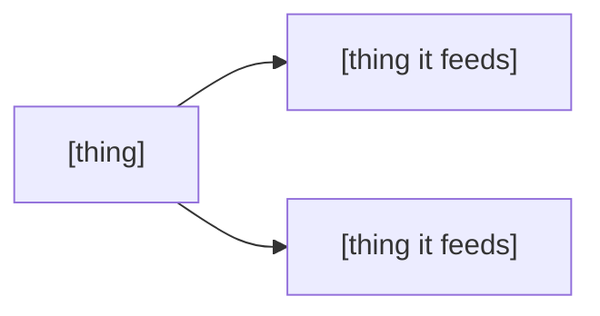

# README skeleton

Copy this, fill the placeholders, delete the sections the project has not earned. Bracketed placeholders stay in the output when the fact is unavailable — the author completes them.

````markdown
# [Project Name]

<div align="center">

<!-- Delete this block entirely if you have no hero image; a placeholder in src
     renders as a broken icon. Commit the asset, and serve both themes:
<picture>
  <source media="(prefers-color-scheme: dark)" srcset="assets/hero-dark.svg">
  
</picture>

<br />
-->

**[Two or three words. Who or what this is.]**

[One sentence: what it does, and what it runs on.]

<br />

[Live Site]([url]) · [Report Issue]([repo]/issues)

<br />

[](https://nextjs.org/)
[](https://www.typescriptlang.org/)

</div>

---

### Features

- **[Term]** — [what it does]
- **[Term]** ([concrete handle: route, shortcut, endpoint]) — [what it does]

---

### Tech Stack

<!-- HTML, not markdown: a markdown table cannot omit its header row, and an
     empty one renders as a blank row above the first entry. Use <code>, not
     backticks — markdown does not run inside a block-level HTML table. -->

<table>
<tr><td><b>Framework</b></td><td>[name version] · [tooling]</td></tr>
<tr><td><b>Language</b></td><td>[name version]</td></tr>
<tr><td><b>Testing</b></td><td>[runner] · [e2e] · [property-based]</td></tr>
<tr><td><b>Deploy</b></td><td>[where and how]</td></tr>
</table>

---

### Project Structure

<!-- A diagram earns its place only where a relationship is the point — a request
     path, a build pipeline, a dependency direction. A tree of folders is not a
     relationship; if that is all you have, keep the tree and delete this. -->



<details>
<summary>The directories behind that</summary>

```
src/
├── [dir]/                  [what lives here]
│   └── [dir]/              [what lives here]
└── [dir]/                  [what lives here]
[top-level dir]/            [what lives here]
```

</details>

---

### Getting Started

```bash
git clone [repo url]
cd [project]
cp .env.example .env        # fill in credentials
[install command]
[dev command]               # → http://localhost:[port]
```

**Prerequisites** — [runtime version], [package manager version], [task runner]

<!-- One path inline, every alternate folded. A reader takes their own and never
     scrolls the rest. Drop this when there is only one way in. -->

<details>
<summary><b>[Other platform, package manager, or install route]</b></summary>

```bash
[commands for that route]
```

</details>

> [!NOTE]
> [The one thing a reader gets wrong if nobody tells them — a default that is not
> what they expect, a prerequisite that is not obvious, a step that is not
> reversible. One alert per page; a second one costs the first its weight.]

**Common tasks** — `just` (or `just help`) lists everything

```
just dev          [description]
just lint         [description]     just typecheck   [description]
just test         [description]     just test-e2e    [description]
just build        [description]     just check       [description]
```

---

### Documentation

[Where the engineering docs live, one sentence, with a link. If none exist, drop this section.]

---

### Deployment

[What triggers it] — [what it produces], [where it lands]. See
[`[path to runbook]`]([path to runbook]) for the full runbook.

---

### [Domain section]

[What this repository owns, and — where a reader would otherwise go looking — what it does not.]

---

<div align="center">
<sub>Built by [author]</sub>
</div>
````

## Hero and badges

Both are covered in [banner.md](banner.md): committing the asset, the `<picture>`
block that serves both themes, what an SVG may contain, and the one badge per
primary technology that earns its place.

The short version, for the block above — no asset means dropping the `` and
the `<br />` after it, never leaving a placeholder in `src`; and no badges for
build status, download counts, licence, "PRs welcome", or code style.

## The centred sentence

The line under the bold label is the same sentence as the forge's About field and
the package manifest's `description`. Settle it once and paste it three times; do
not write a second version of it here.
